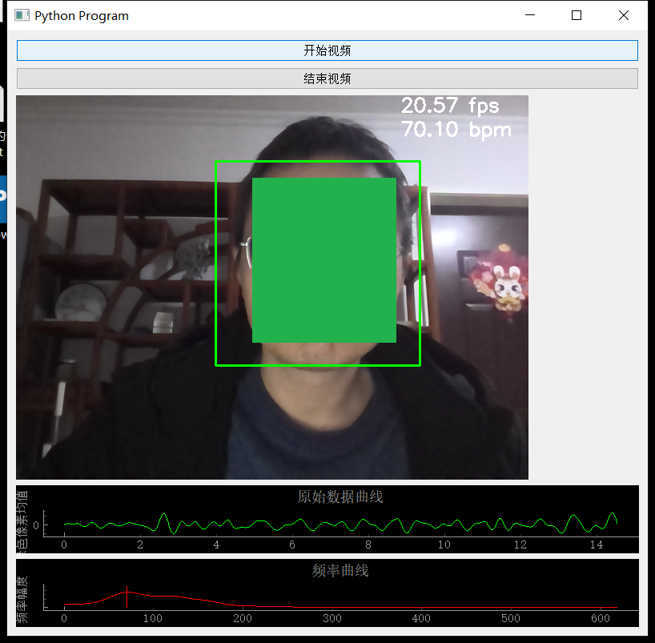

this is a heart rate measuring from camera video.

less than 200 lines of code.




# how to use:

```
pip install -r requirements.txt
python3 heart_rate_from_camera.py
```

highly inspired by:
https://github.com/habom2310/Heart-rate-measurement-using-camera